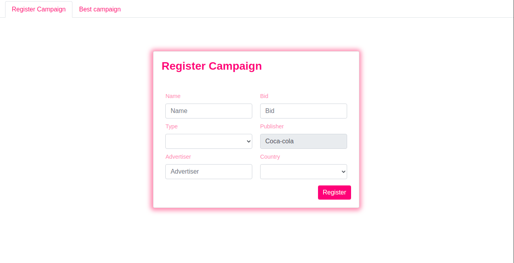
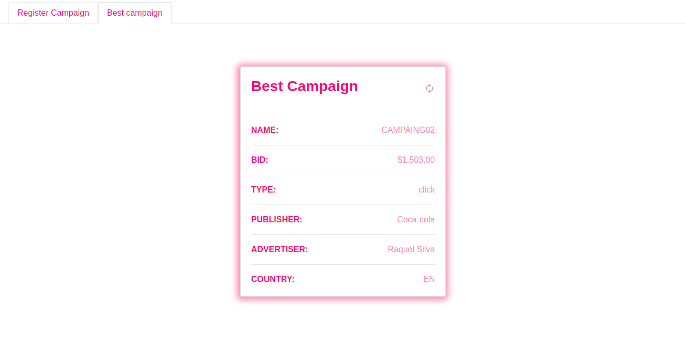

<p align="center">
  <a href="" rel="noopener">
 </a>
</p>

<h3 align="center">Software Engineer Challenge</h3>

---

## ⛏️ Built Using <a name = "built_using"></a>

- [MongoDB](https://www.mongodb.com/) - Database
- [Express](https://expressjs.com/) - Server Framework
- [React](https://pt-br.reactjs.org/) - Web Framework
- [NodeJs](https://nodejs.org/en/) - Server Environment

---

## 📝 Table of Contents

- [Back-End](#back_end)
- [Front-End](#front_end)

## 💻 Back-end <a name = "back_end"></a>

### Installing Project Dependencies

```
yarn || npm install
```

### Starting api and database with docker

If you don't have docker here is the site to install https://docs.docker.com/get-docker/

```
docker-compose up -d
```

If you want to drop the api type Ctrl + c

---

## 🖥 Front-End] <a name = "front_end"></a>

### Installing Project Dependencies

```
yarn || npm install
```

### Starting a project

```
yarn start || npm start
```

---

</a>
</a>

## ✍️ Authors <a name = "authors"></a>

- [@lourencovitor](https://github.com/lourencovitor) - Vitor Lourenço da Silva
